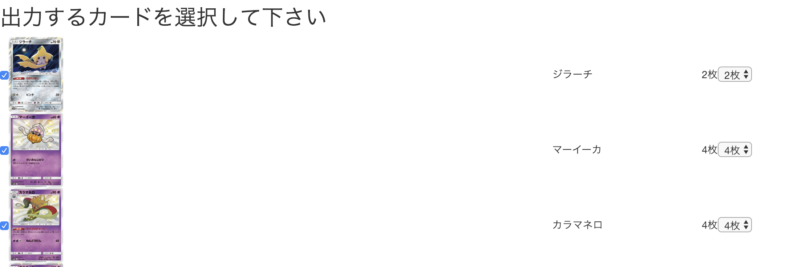

# ptcg-prox
## Web application for making proxy for ptcg

### Heroku Link

Preparing

### What can you do ?

Make any deck with just 350 yen !!

(color copy * number of PDF = 50 * 7 = 350)

### How to use

1. Run data_collect.py and scraoe image data

2. Deploy to heroku

3. Throw deck code as a query

4. Push convert to pdf

### Some screenshots
1.
* Deck code query

* Selecting cards

* PDF output

### TODO:

1. Heroku free plan does not support this application (lack of storage)
2. Use bootstrap to make the UI better
3. Change the routing system
4. Refactor the code